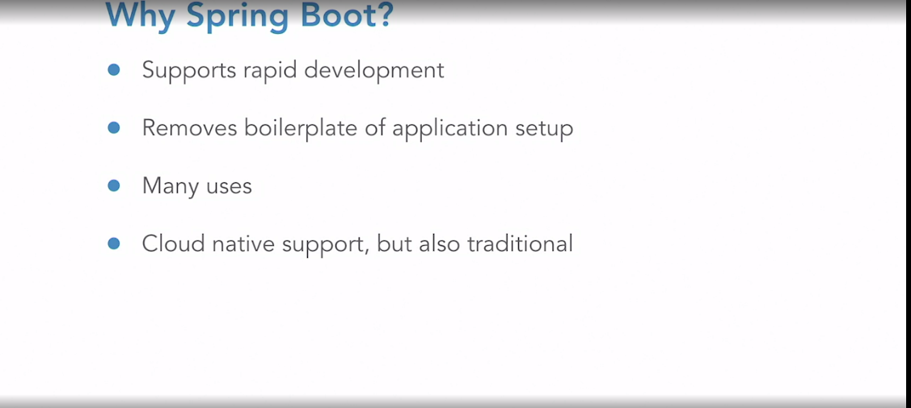
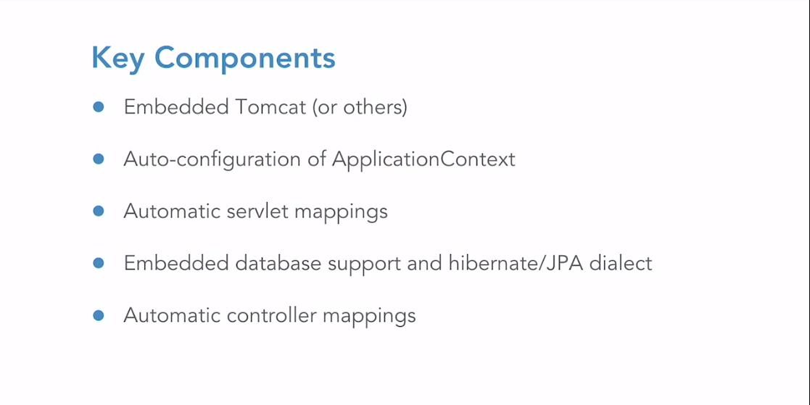
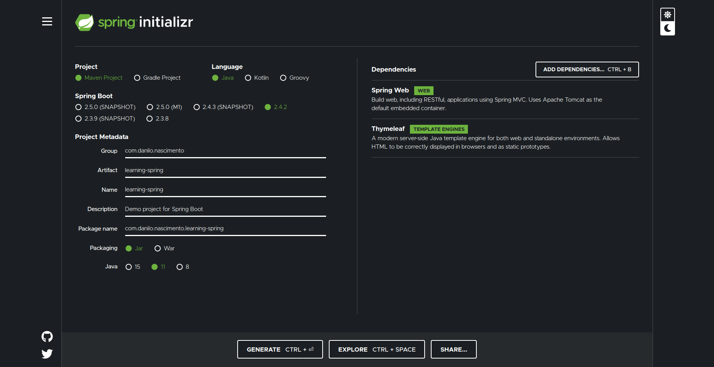

# Introdução ao Spring Boot

## Definições

- POJO: Plain old Java Object
- JavaBeans: Objetos simples com getters e setters
- Spring Beans: POJOs configurados no contexto da aplicação
- DTO: Bean usado para state estado entre layers

## Inverse of Control (IoC)

É um design pattern conhecido pela Sigla IoC é um Pattern que prega para usarmos o controle das instancias de uma determinada classe ser tratada externamente e não dentro da classe em questão, ou seja, Inverter o controle de uma classe delegando para uma outra classe, interface, componente, serviço, etc.

- [ ] [Artigo com exemplo JS para melhor entendimento](https://blog.codecasts.com.br/dependency-injection-container-javascript-49e9eb2c399c)
- [ ] [Artigo com exemplos](http://www.linhadecodigo.com.br/artigo/3418/inversao-de-controle-ioc-e-injecao-de-dependencia-di-diferencas.aspx)

## Porque usar Spring Boot







Após gerar o arquivo compactado, descompacte no diretório de destino e importe o projeto na IDE.

Para adicionar a index.html:
- crie o arquivo em src/resources/static
- No terminal, execute o comando para gerar o arquivo .jar:

```
mvn clean package
```

- Para executar o jar e iniciar o servidor, execute o comando:
```
java -jar target/{fileName}.jar
```
A anotação que define o ponto de partida do Spring é @SpringBootAplication:

```java
@SpringBootApplication
public class SpringApplication {

	public static void main(String[] args) {
		SpringApplication.run(SpringApplication.class, args);
	}

}
```

