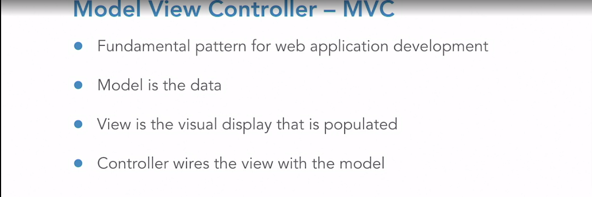
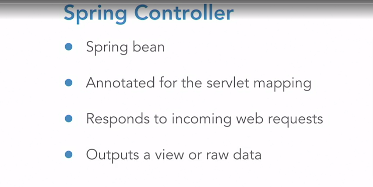
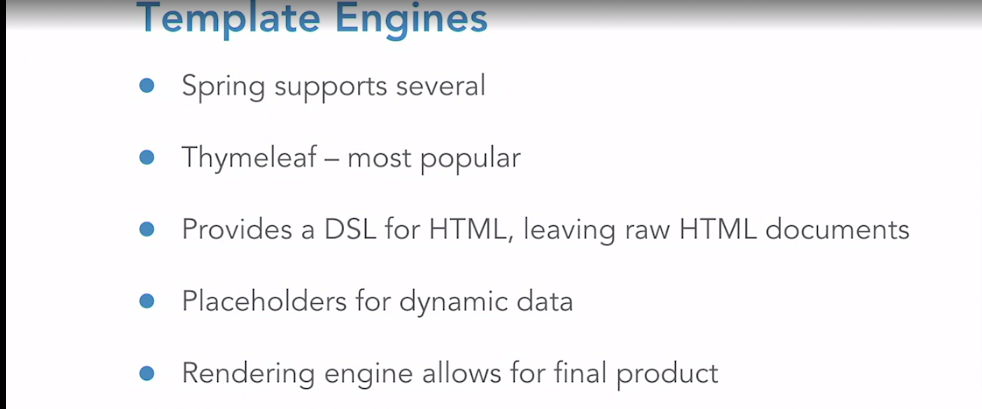
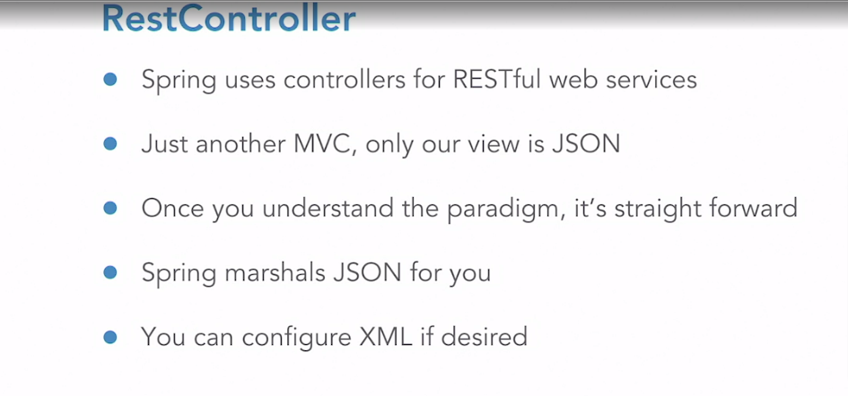

# Introdução ao Spring Boot

## Definições

- POJO: Plain old Java Object
- JavaBeans: Objetos simples com getters e setters
- Spring Beans: POJOs configurados no contexto da aplicação
- DTO: Bean usado para state estado entre layers
- Utiliza o Tomcat como servidor por padrão

## Inverse of Control (IoC)

É um design pattern conhecido pela Sigla IoC é um Pattern que prega para usarmos o controle das instancias de uma determinada classe ser tratada externamente e não dentro da classe em questão, ou seja, Inverter o controle de uma classe delegando para uma outra classe, interface, componente, serviço, etc.

## O que é um boilerplate

Um conjunto de códigos padrão que são utilizados sempre


## TODO

- [ ] [Artigo com exemplo JS para melhor entendimento do IoC](https://blog.codecasts.com.br/dependency-injection-container-javascript-49e9eb2c399c)
- [ ] [Artigo com exemplos de IoC](http://www.linhadecodigo.com.br/artigo/3418/inversao-de-controle-ioc-e-injecao-de-dependencia-di-diferencas.aspx)
- [ ] O que são Servlets
- [ ] O que são JPA e Hibernates
- [ ] [Spring Data](https://spring.io/projects/spring-data)
- [ ] org.springframework.stereotype.Repository ?
- [ ] Anotações do Spring
- [ ] application.properties
- [ ] [@Autowired](https://blog.algaworks.com/injecao-de-dependencias-com-spring/)
  - [ ] https://www.youtube.com/watch?v=1BZ61FDm1tw
- [ ] [Aspect Oriented Programming](https://docs.spring.io/spring-framework/docs/2.5.x/reference/aop.html)
- [ ] A camada que trata os dados recebe os pacotes entity e respository como boa prática?
- [ ] Spring Bean:
  - [ ] https://www.baeldung.com/spring-bean
  - [ ] https://medium.com/@decioluckow/explorando-bean-spring-ioc-e640c53d29a9
- [ ] [Diferenças entre @Component, @Service e @Repository](https://receitasdecodigo.com.br/spring-framework/component-repository-service-em-spring)
- [ ] Como tratar datas
- [ ] org.springframework.ui.Model
- [ ] Comparando Objetos
  - [ ] https://www.tutorialspoint.com/java/java_using_comparator.htm
  - [ ] https://blog.caelum.com.br/ordenando-colecoes-com-comparable-e-comparator/amp/
- [ ] Teste Unitários
  - [ ] https://www.baeldung.com/mockito-series
  - [ ] https://www.linkedin.com/learning/spring-test-driven-development-with-junit/welcome
  - [ ] https://www.linkedin.com/learning/practical-test-driven-development-for-java-programmers/welcome
- [ ] xmlns:th="http://thymeleaf.org"
- [ ] Ao importar métodos estáticos, cuidado para não esquecer de colocar static após import: 
    ```java
    import static org.springframework.test.web.servlet.request.MockMvcRequestBuilders.get;
    ```

## Porque usar Spring Boot


Após gerar o arquivo compactado, descompacte no diretório de destino e importe o projeto na IDE.

Para adicionar a index.html:
- crie o arquivo em src/resources/static
- No terminal, execute o comando para gerar o arquivo .jar:

```
mvn clean package
```

- Para executar o jar e iniciar o servidor, execute o comando:
```
java -jar target/{fileName}.jar
```
A anotação que define o ponto de partida do Spring é @SpringBootAplication:

```java
@SpringBootApplication
public class SpringApplication {

	public static void main(String[] args) {
		SpringApplication.run(SpringApplication.class, args);
	}

}
```

## Spring Data

Os bancos de dados incorporados não devem ser usados ​​para cargas de trabalho de produção, pois eles duram apenas enquanto o aplicativo.

Os arquivos referentes ao banco de dados (data.sql e schema.sql) devem ficar em: src/main/resources

Para utilizar o banco de dados, adicione no arquivo application.properties:
```
spring.jpa.hibernate.ddl-auto=none
logging.level.org.springframework.jdbc.datasource.init.ScriptUtils=debug
# Log do banco de dados
logging.level.org.hibernate.engine.jdbc.env.internal.LobCreatorBuilderImpl=error
```
Execute o comando para atualizar o banco de dados:
```
mvn clean package
```
Ele funciona com banco de dados SQL ou NoSQL

As classes, interfaces, etc que são referentes aos dados, devem ficar dentro do seus próprios pacotes data:

```java
package com.danilo.nascimento.learningspring.data.entity;
package com.danilo.nascimento.learningspring.data.repository;
```

### Gerenciamento do banco de dados

O PostgreSQL precisa estar instalado e com o PATH configurado para usar scripts bash

[Instalar PostgreSQL no Ubuntu](https://www.postgresql.org/download/linux/ubuntu/)

[Solução para o Erro 'http://apt.postgresql.org/pub/repos/apt focal-pgdg InRelease' doesn't support architecture 'i386'](https://askubuntu.com/questions/1230969/skipping-acquire-of-configured-file-in-ubuntu-20-04-lts)

#### Qual a configuração para acessar dados do banco?

1. Crie uma classe responsável pela entidade
1. Na classe, defina a tabela da entidade com as anotações:
    . 
    ```java
    @Entity
    @Table(name = {tableName})
    ``` 
1. No body da classe use as anotações para definir as características da coluna:
    
    ```java
    @Id // No caso de ser a chave primária
    @Column(name = {columnName})
    @GenerateValue(strategy = GenerationType.{Option}) // Uma opção é AUTO. Precisa ver documentação das opções para 
    private {dataType} {fieldName};
    // Caso esteja pegando data do SQL, importe o pacote java.sql.date
    ```
1. Adicione os getters e setters à classe
1. Crie uma interface que extenda CrudRepository:
    
    A classe CrudRepository recebe a classe da entidade criada anteriormente e o tipo de dado da chave primária:

    ```java
    public interface {interfaceName} extends CrudRepository< {entityClass} , {foreinerKey} > {

    }
    ```
    Ao criar métodos dentro da Interface, cuidado com os nomes. Por exmeplo: findReservationByResDate representa find (buscar) Reservation (Tipo do Objeto) By ResDate (Propriedade / Campo)
1. Adicione a classe principal (com a anotação SpringBootApplications) as anotações e classe controller:

    ```java
    @RestController
    @RequestMapping({endpoint})
    public class {entityName}Controller {
        @AutoWired
        private {entityRepository} {entityRepositoryField}

        @GetMapping
        public Iterable<{entityClass}> get{entityName} {
            return this.{entityRepositoryField}.findAll();
        }
    }
    ```
#### PostgreSQL

Adicione a dependência que irá gerenciar o banco de dados no pom.xml

```xml
<dependency>
    <groupId>org.postgresql</groupId>
    <artifactId>postgresql</artifactId>
</dependency>
```

Adicione as propriedades no arquivo application.properties:
```
spring.jpa.database=postgresql
spring.datasource.platform=postgres
spring.datasource.url=jdbc:postgresql://localhost:5432/dev
spring.datasource.username=postgres
spring.datasource.password=postgres
```

Não esqueça de iniciar o serviço no Docker

***

São utilizadas anotações para definir:
- **Gerenciamento do banco de dados:**
  - Entidades
  - Colunas
  - Chaves Primárias
  - etc
- **REST**
  - Verbos
  - Recursos (Endpoints)

***

## Criando regras de negócio (Serviços)

Separe sempre em packages

Exemplos: 
- com.{appName}.business.service (lógica das regras de negócio)
- com.{appName}.business.domain (fields, getters e setters)

Adicionar as dependências como *final* é uma boa prática

Utilize a anotação @Service para componentes de Serviço e @Repository para os de persistência

Utilize a anotação @AutoWired para deixar evidente qual o construtor padrão e determinar o Id da classe na aplicação toda. Um detalhe muito importante: o Spring só consegue injetar objetos que sejam Components dele.

Java or XML Config are other ways of getting the Spring IoC container configured with the new class.

The Bean Factory or IoC container is the what gets configured for Spring applications.

***

## MVC







In Spring, the controller abstraction is the controller for the MVC pattern. It is indeed the heart of web application development in the Spring framework. It is nothing more than a Spring bean however. 

You start with a POJO, and then decorate it in specific fashion to make it a controller. 

Those decorations are in the form of annotations. Both class-level and method-level annotations, provide the needed behavior to be aspected in to allow for servlet mapping. 

The methods, once annotated, respond to incoming web requests and perform work. When they have completed the job, they output either raw data or a view. Template engines also come into play with the MVC pattern in Spring. 

Often, we are building webpages, and we need a clean way to support the merging of static content with dynamic data. 

Spring supports several template engines out of the box. Now we have already added Thymeleaf, which is one of the most popular templating engines, to the mix on our application. 

Most engines provide a robust DSL or pattern for using raw documents, that are viewable in supplying the dynamic placeholders that are needed to merge the model into the view. In my opinion, Thymeleaf does this the best. The placeholders for dynamic data don't actually show up in the HTML document. So you can style the page without data, giving you good separation of concerns. The template engine will then render the final visual merging the template or view, with the data or model. So let's go build a view for our application.

### Criando o Controller

- Crie um package web
- Crie no package web a classe controller: {entityName}WebController. A finalidade dessa classe é tratar as requests referentes à entidade / lógica
- Na classe adicione as anotações responsáveis pelos endpoints: @Controller, @ResquestMapping e os métodos ({Method}Mapping)
- O método responsável pela request pode receber o parâmetro anotação @RequestParam
- O package org.springframework.ui.Model pode ser passado por parâmetro também ao @{method}Mapping. Desta forma, esses métodos podem retornar o nome do template e os dados no Model.

### Criando o Service

- Crie um package business.service.{entityName}{logic}
- Crie a classe responsável pelo serviço
- Injete as dependências
- Crie os métodos responsáveis pelas requisições
- Crie os métodos que executatam as regras de negócio

### Criando a View utilizando o template Thymeleaf

- Em resources/templates, crie o arquivo html com o nome da entidade ou lógica
- Adicione à declaração html xmlns:th="http://thymeleaf.org"
- Para percorrer dados multivalorados utilize:
  ```html
  <div th:each="name: ${listName}">
    <p th:text="${name.prop}">Placeholder</p>
  </div>
  ```

***

### Desafio curso

Criar uma nova View listando guests ordenados pelo sobrenome. O resultado deve conter: last name, first name, email, endereço e telefone.

What does RestController add to each method annotated with a mapping annotation that Controller doesn't?
The @ResponseBody annotation allows for JSON or XML Mapping of the Response Object.

Which annotation is used to indicate the component that is at the heart of a MVC pattern?
@Controller: Controllers are the heart of Spring MVC.

***

### RestController



- Crie uma classe {entityName}WebServicesController
- Adicione antes da declaração da classe as anotações @RestController e @RequestMapping
- Injete as dependências
- O retorno dos dados será em JSON